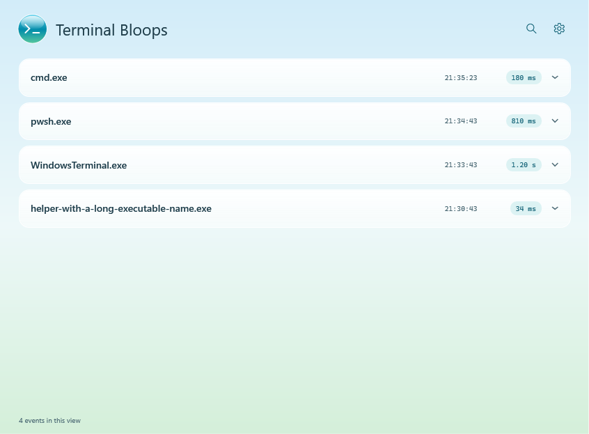
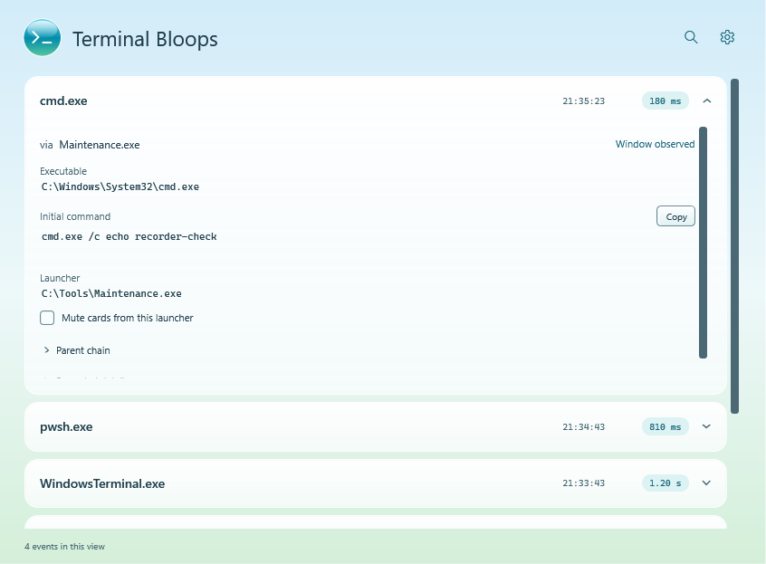
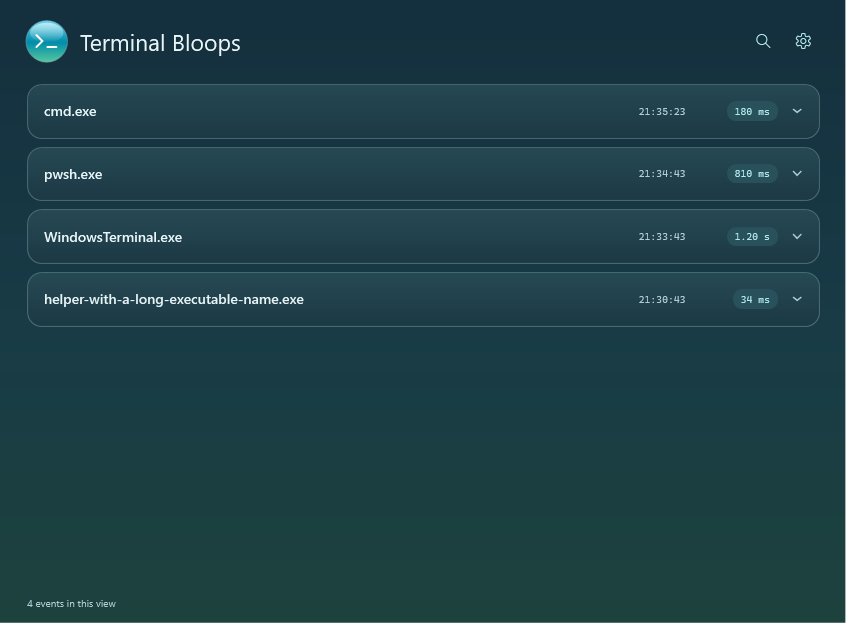
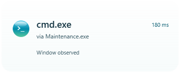

<div align="center">


# Terminal Bloops

**What just ran?**

A quiet Windows 11 tray app for the terminal window that vanished before you could read it.

[](https://github.com/ChromiteExabyte/terminalBloops/actions/workflows/windows.yml)

C# · WPF · .NET 10 · SQLite · Sysmon

[Build & run](#build--run) · [How it works](docs/architecture.md) · [Recorder setup](docs/recorder-setup.md) · [Verification](VALIDATION.md)

</div>

<picture>
  <source media="(prefers-color-scheme: dark)" srcset="docs/images/history-dark.png">
  
</picture>

<p align="center"><sub>Real application UI, rendered with synthetic sample events. No captured user activity is shown.</sub></p>

**Development preview.** The desktop interface and event-processing pipeline are implemented and covered by automated checks. Live recording still needs end-to-end validation: Sysmon's event-manifest registration fails on the development machine. See the [validation report](VALIDATION.md#this-machines-deployment-result) for the exact boundary between tested behavior and outstanding work.

## A small answer to a small mystery

A shell flashes open, closes, and leaves no explanation. Terminal Bloops is built to connect that moment to an executable, its initial command, and the process that launched it.

- **A glance first.** Brief activity means a completed run of five seconds or less. Quiet cards expire after six seconds, never take keyboard focus, and collect bursts into an overflow count.
- **Details when you ask.** Expand a row for its command, launcher, window evidence and recorded ancestry. Search, filters and preferences stay tucked into drawers.
- **Evidence with limits.** “Window observed,” “Visibility unconfirmed” and “Command unresolved” are distinct states. A console process starting is not proof that a window appeared.
- **Local history.** SQLite stores application history for seven days with size pruning. Sysmon provides the persistent event source; a new recorder installation uses a 256 MiB rolling log.

The Frutiger Aero styling brings soft sky and green tones, glass highlights and a glossy terminal orb to a deliberately minimal interface. Windows light, dark and high-contrast preferences are supported. There are no decorative animations or notification sounds.

<details>
<summary><strong>See event details, dark mode, and notification cards</strong></summary>

### Expand only what you need



### After dark



### A quiet desktop glance



[View high-contrast mode](docs/images/high-contrast.png). All screenshots use the same controlled test fixtures; see [image provenance](docs/images/README.md).

</details>

## Build & run

Use **Windows 11 x64** with the **.NET 10 SDK** installed. The published app includes its runtime.

```powershell
git clone https://github.com/ChromiteExabyte/terminalBloops.git
cd terminalBloops
powershell.exe -NoProfile -ExecutionPolicy Bypass -File .\scripts\Build.ps1 -Configuration Release
powershell.exe -NoProfile -ExecutionPolicy Bypass -File .\scripts\Publish.ps1
Start-Process .\artifacts\publish\TerminalBloops.exe
```

Keep the whole `artifacts\publish` folder together. The regular app runs as your normal user; **Settings → Set up recorder** starts the separate, one-time elevated helper. An existing Sysmon installation and its capture configuration are preserved. Building and testing never install Sysmon. Read the [setup guide](docs/recorder-setup.md) before enabling recording.

The [Windows build workflow](https://github.com/ChromiteExabyte/terminalBloops/actions/workflows/windows.yml) also produces a downloadable, self-contained build artifact after successful checks. These are development builds, not signed releases.

## Engineering choices

| Problem | Approach |
| --- | --- |
| Very short launches disappear before a polling loop sees them | Read durable Sysmon process-create and process-terminate events. |
| Windows reuses process IDs | Use Sysmon process GUIDs for identity; check creation timestamps when matching window observations. |
| Restarting can replay the same events | Commit process changes and the event-log checkpoint in one SQLite transaction, then deduplicate replay. |
| A terminal host is not necessarily the command that ran | Keep host/client links only when supported by evidence; leave unresolved attribution explicit. |
| Useful metadata can overwhelm the interface | Reveal details inline, one event at a time, while keeping cards free of command arguments. |
| The recorder needs more privilege than the UI | Separate the elevated setup helper from the unelevated tray application. |

[Explore the architecture and source map →](docs/architecture.md)

## Scope & privacy

Terminal Bloops records **launch metadata**, not terminal output or commands subsequently typed into an existing shell. It does not force terminals to stay open, decide whether activity is malware, or reconstruct events that Sysmon never recorded. Windows Terminal pane attribution can remain unresolved, and window observation only works while the app is running in that interactive session.

History stays on the machine, with no telemetry or application network API. **Initial command lines can contain secrets.** They are excluded from notification cards. Sysmon records system-wide activity, so permission to read its channel can expose other users' command lines even though the app defaults to the current user's history. Review exported diagnostics before sharing them.

## Verification

- **70 automated tests:** durations, PID reuse, out-of-order events, replay, ancestry, window evidence, retention, classification and notification policy.
- **Windows PowerShell helper checks:** recorder rules, permission preservation and interrupted-install recovery without changing machine settings.
- **Interactive UI smoke checks:** progressive disclosure, filtering, card focus behavior, burst limits and expiration, plus light/dark/high-contrast renders.

CI checks the build, unit tests, helper tests and publish output. Interactive desktop and live-recorder validation are separate; a green build does not imply live capture has been verified. [Reproduce the checks and see current limitations →](VALIDATION.md)

---

An independent Windows desktop project by [ChromiteExabyte](https://github.com/ChromiteExabyte). Not affiliated with Microsoft or PowerToys. The orb artwork is [drawn in code](https://github.com/ChromiteExabyte/terminalBloops/blob/main/scripts/Generate-Icon.ps1); Sysmon is obtained separately from Microsoft during explicit recorder setup.
