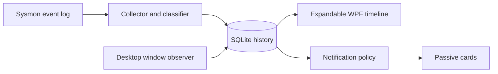

# How Terminal Bloops works

The application keeps recording, interpretation, storage and presentation separate. Sysmon supplies a durable history of process starts and exits. A per-user window observer contributes independent visibility evidence. The WPF application combines those facts into an inspectable timeline.

## Identity before presentation

The durable key is the Sysmon process GUID, not the PID. A start and an exit can arrive in either order; unmatched exits are retained until the corresponding start appears. Missing termination events leave duration unknown. The inclusive brief-activity boundary is five seconds, calculated from recorded timestamps.

The classifier recognizes known shells and terminal hosts and reads an executable's PE subsystem to identify other console applications. It does not execute a file to classify it. Deleted, unreadable or malformed binaries remain unclassified unless other available evidence supports classification.

The window observer uses Windows event hooks in the interactive user session. Window ownership is correlated with process creation timestamps to avoid treating a reused PID as the same process. A supported host/client relationship can suppress a duplicate host entry; unsupported relationships stay unresolved. Starting `cmd.exe`, `conhost.exe` or Windows Terminal alone never establishes visible-window evidence.

## Durable ingestion

Process state, source bookmarks and checkpoint fingerprints are stored transactionally. Replayed events are deduplicated, and replay does not generate historical notification cards. This allows the UI to restart and import the retained Sysmon history without turning an old burst into a new interruption.

Bookmarks cannot recover overwritten event-log records. Capture notices expose missing permissions, unavailable producers, recording gaps and observer downtime. The local application store prunes history by age and size; Windows controls the separate rolling Sysmon log.

## A quiet desktop surface

The application is a Windows executable (`WinExe`), so launching it creates no console window. The tray owns the application lifetime; closing the history window hides it. Start-at-login launches the app in tray mode.

The default view contains collapsed event rows. Expanding a row selects its process record and loads the recorded parent chain; only one row opens at a time. Search and settings occupy separate drawers. Full command lines are available inside an expanded event and remain absent from notification cards.

Notification policy considers duration, current-user identity, global muting, exact launcher-path muting and replay status. Up to three cards appear together, with excess activity counted in a clickable overflow card. Native `WS_EX_NOACTIVATE` and mouse-activation handling let the cards appear without taking keyboard focus.

## Privilege boundary

Only the explicit setup helper requests elevation. A new setup downloads Microsoft's Sysmon binary, verifies its Authenticode signature, configures process logging and grants a narrow read permission on the event channel. An existing recorder's installation, rules and retention remain under its administrator's control.

Setup ownership metadata is protected under ProgramData; per-user result JSON is a status report, not proof of ownership. Removal uses that protected metadata and verification checks before changing an owned recorder. See the [recorder guide](recorder-setup.md) for the permission model and recovery behavior.

## Source map

| Area | Entry points |
| --- | --- |
| Process model, identity and timing | [Models.cs](https://github.com/ChromiteExabyte/terminalBloops/blob/main/src/TerminalBloops.Core/Models.cs) |
| Transactions, replay, ancestry and pruning | [HistoryStore.cs](https://github.com/ChromiteExabyte/terminalBloops/blob/main/src/TerminalBloops.Core/HistoryStore.cs) |
| Event-log subscription and health | [SysmonCollector.cs](https://github.com/ChromiteExabyte/terminalBloops/blob/main/src/TerminalBloops.App/Capture/SysmonCollector.cs) |
| PE and known-shell classification | [TerminalClassifier.cs](https://github.com/ChromiteExabyte/terminalBloops/blob/main/src/TerminalBloops.App/Capture/TerminalClassifier.cs) |
| Window hooks and correlation evidence | [WindowObserver.cs](https://github.com/ChromiteExabyte/terminalBloops/blob/main/src/TerminalBloops.App/Capture/WindowObserver.cs) |
| Pipeline orchestration | [AppController.cs](https://github.com/ChromiteExabyte/terminalBloops/blob/main/src/TerminalBloops.App/Services/AppController.cs) |
| Progressive disclosure and themes | [MainWindow.xaml](https://github.com/ChromiteExabyte/terminalBloops/blob/main/src/TerminalBloops.App/Views/MainWindow.xaml), [ThemeManager.cs](https://github.com/ChromiteExabyte/terminalBloops/blob/main/src/TerminalBloops.App/Themes/ThemeManager.cs) |
| Card policy and passive windows | [NotificationPolicy.cs](https://github.com/ChromiteExabyte/terminalBloops/blob/main/src/TerminalBloops.Core/NotificationPolicy.cs), [NotificationCard.cs](https://github.com/ChromiteExabyte/terminalBloops/blob/main/src/TerminalBloops.App/Views/NotificationCard.cs) |
| Automated and interactive checks | [tests](https://github.com/ChromiteExabyte/terminalBloops/tree/main/tests/TerminalBloops.Tests), [UI smoke test](https://github.com/ChromiteExabyte/terminalBloops/blob/main/src/TerminalBloops.App/Diagnostics/UiSmokeTest.cs) |

## Current validation boundary

The processing pipeline is exercised with controlled fixtures, and the desktop UI is exercised through its explicit smoke-test mode. Live capture is not yet validated end to end on the development machine because Sysmon's Windows event-manifest registration fails there. [The validation report](../VALIDATION.md) records that limitation and the checks needed to close it.
